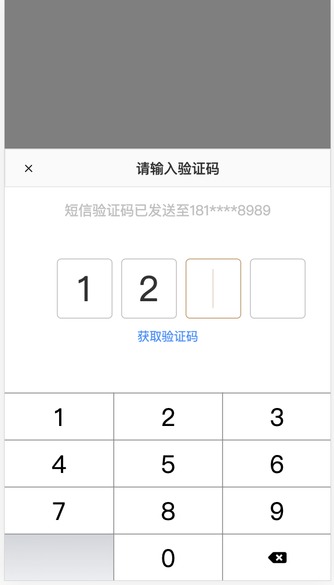

## react-vitual-keyboard

### Install
```
npm install react-vitual-keyboard --save
```

### Example



### Usage
```
import React from 'react';
import CodeInput from 'react-vitual-keyboard';

interface IProps {
}
interface IState {
    show: boolean;
}
class App extends React.Component<IProps, IState> {
    constructor(props: IProps) {
        super(props);
        this.state = {
            show: true,
        };
    }

    public handleClose(show: boolean) {
        this.setState({
            show,
        });
    }

    public handleInput(numbers: number[]) {
        console.log('The user is typing', numbers);
    }

    public handleFinish(numbers: number[]) {
        console.log('I've typed it in', numbers);
    }

    public handleSendCode() {
        console.log('User click please send verification code');
    }

    public render() {
        return (
            <div>
                <CodeInput
                    num={4}
                    show={this.state.show}
                    onClose={this.handleClose}
                    onInput={this.handleInput}
                    onFinish={this.handleFinish}
                    onSendCode={this.handleSendCode}
                />
            </div>
        );
    }
}
export default App;
```

### Local run modification
```
You can download the source code and modify it yourself

npm install
npm run serve
npm run build
```